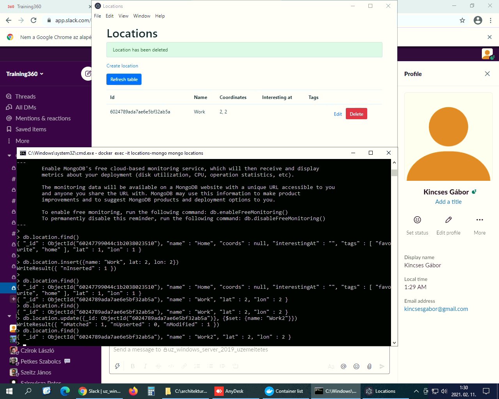

# Előrehaladás ellenőrzése

## Standalone konzolos alkalmazás (gyakorlat)

## Standalone alkalmazás grafikus felülettel (gyakorlat)

## Központi adatbázis (gyakorlat)

## SQL nyelv (gyakorlat)

## NOSQL adatbázisok (gyakorlat)

## Többrétegű alkalmazások (gyakorlat)

## Webes alkalmazás (gyakorlat)

## Web formátumai HTML és CSS (gyakorlat)

